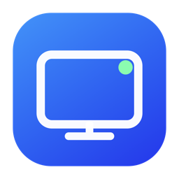

<p align="center">
  
</p>

<h1 align="center">ADB Deck</h1>

<p align="center">A native macOS command center for Android devices on your local network.</p>

<p align="center">
  <a href="https://github.com/andiq123/adbdeck/releases/latest"></a>
  <a href="https://github.com/andiq123/adbdeck/actions/workflows/ci.yml"></a>
  
</p>

## One place for every Android screen

ADB Deck discovers ADB-enabled TVs, streaming boxes, phones, tablets, and car head units. It identifies familiar hardware, keeps active devices easy to reach, and turns wireless ADB into a focused Mac experience.

<table>
  <tr>
    <td width="50%"> <strong>Automatic discovery</strong><br><sub>Find and identify ADB devices across the local network.</sub></td>
    <td width="50%"> <strong>App control</strong><br><sub>Install, launch, force quit, clone, and remove apps—including APKM packages—and keep a chosen Fire TV launcher active without the Mac connected.</sub></td>
  </tr>
  <tr>
    <td> <strong>File management</strong><br><sub>Browse, size, transfer, organize, and clean device files.</sub></td>
    <td> <strong>Device health</strong><br><sub>Monitor storage, app usage, CPU, and memory.</sub></td>
  </tr>
</table>

## Use it

1. [Download the latest DMG](https://github.com/andiq123/adbdeck/releases/latest).
2. Drag **ADB Deck** to **Applications**.
3. Enable ADB or wireless debugging on the Android device.
4. Open ADB Deck, select the device, and approve its connection prompt.

Requires macOS 14 or later. Devices must be on the same network as the Mac.

## Build

Open `ADBDeck.xcodeproj` in Xcode, or run:

```sh
./scripts/package.sh
```

The app, ZIP, and DMG are written to `dist/`.
